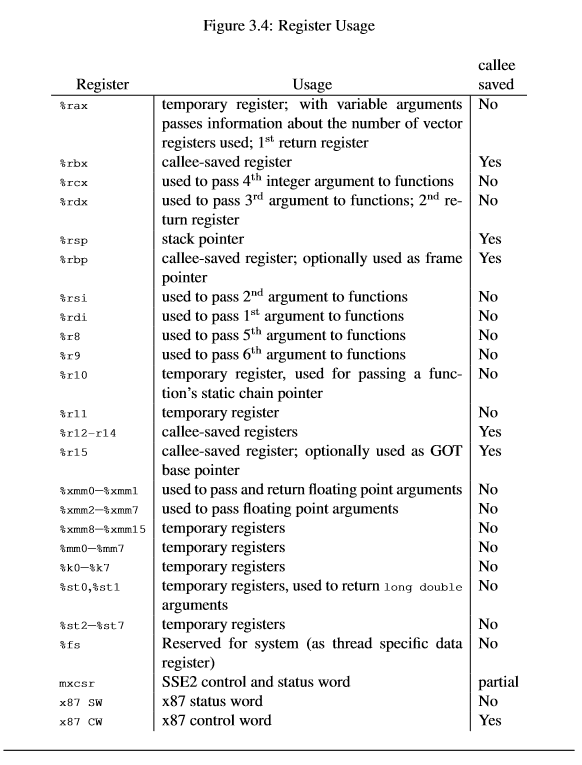

# 两百行Rust代码解析绿色线程原理（一）绪论及基本概念

> 原文: Green threads explained in 200 lines of rust language  
> 地址: https://cfsamson.gitbook.io/green-threads-explained-in-200-lines-of-rust/    
> 作者: Carl Fredrik Samson(cfsamson@Github)  
> 翻译: 耿腾 翟堃

----

> 本书旨在通过一个小例子解释绿色线程。我们会实现一个简单但能工作的程序，在这个程序中我们可以使用自己实现的绿色线程来执行代码。

> 译者注：原书前三章分别为 **绪论(Introduction)**、**绿色线程(Green Threads)**、**背景信息(Background Information)**，因篇幅较短，我在本译文系列中把它们合并为 **绪论及基本概念**。

## 绪论

> 我们在这里使用的所有代码都存储在一个[Github仓库](https://github.com/cfsamson/example-greenthreads)中。该库有两个分支，主分支（master）只包含代码，注释分支（commented）包含代码以及注释，其中的注释解释了我们所做的工作。

**绿色线程**，或称用户态线程、goroutine、纤程（译者注：也叫“协程”、“coroutine”），它有许多名称，但为了简单起见，我将从现在开始将它们全部称为 **绿色线程**。

在本文中，我想通过实现一个非常简单的示例来探索它们是如何工作的，用 200 行 Rust 代码创建自己的绿色线程。我们将在整个过程中解析所有相关内容，因此我们关注的重点是通过使用简单但有效的示例来理解它们并学习它们的工作原理。

> 我们不会使用任何外部库或帮助程序，并将从零开始做所有事情，因此我们得确保我们真正了解整个过程中发生了什么。

### 这篇文章是写给谁的？

在这篇文章中，我们会探索兔子洞中的世界（译者注：引喻爱丽丝漫游奇境记中的新世界），如果这听起来很可怕，那么这篇文章可能不适合你，回去过自己幸福的小日子吧。

如果你是一个好奇的人，想要了解这些东西的运作方式，那么请继续读下去。也许你已经听说过 Go 及其提供的 goroutine，或者 Ruby、Julia 中的等价物，你知道如何使用它们但想知道它们是如何工作的——那么也请继续读下去。

此外，这应该会很有趣，如果：

* 你是 Rust 的新手，想要了解有关其功能的更多信息。
* 你已经跟进 Rust 社区中有关 async / await 、Pin-API 以及我们需要 Generator 的原因的讨论。考虑这种情况，我尝试将所有这些一并放在本文中。
* 你想学习Rust中内联汇编的基础知识。
* 你只是好奇。

好吧，加入我，我们将试图弄清楚我们需要了解的关于它们的一切。

你不必是 Rust 程序员就能理解本文，但强烈建议你首先阅读一些基本语法。如果你想长时间跟踪或克隆代码仓库并且跑一下代码，你应该安装 Rust 并学习相关的基础知识。

[你可以在这找到安装 Rust 所需要的一切。](https://www.rust-lang.org/tools/install)

### 继续

我在这里提供的所有代码都在一个文件中并且没有依赖项，这意味着你可以轻松地启动自己的工程并跟着本文完成编码，只要你真的想（我建议你想）。你甚至可以在 [`Rust` 的代码演练页面](https://play.rust-lang.org) 上运行大部分代码。只是要记得使用编译器的 `nightly` 版本。

### 可移植性和一些问题
目前 `asm！` 宏存在一个问题，它不能在 `release` 模式下编译。它似乎与我在内联宏中使用的 `"= m"` 约束有关。

#### 2019-06-21 补充编辑：

我决定解决这个问题并更改内联汇编以在发布版本上编译和运行。
我已经在OSX，Linux 和 Windows 上测试了代码。

### 免责声明

我不打算在这里做一个完美的实现。我正在一步步的尝试深入了解本质，并将其融入原本打算成为文章的内容，而不是扩展为一本小书。这个实现并不能体现 Rust 语言的最大优势——Rust的安全保证机制——不过这确实显示了 Rust 的一个有趣的用法，代码大多非常干净，易于跟进。

但是，如果你发现了可以使代码更安全而不会显著增加复杂性的地方，欢迎你在 [Github 仓库](https://github.com/cfsamson/example-greenthreads)中创建一个问题，甚至能提一个 Pull Request 就更棒了。

### 鸣谢

[Quentin Carbonneaux](https://github.com/mpu) 在 2013 年写了一篇[很棒的文章](https://c9x.me/articles/gthreads/intro.html)，我以它作为主要的代码示例的灵感来源。感谢 [nickelpro](https://github.com/nickelpro) 提供有关 Windows 支持的帮助和反馈。

### 补充编辑

2019-06-18：实现 Windows 支持的新章节.

2019-06-21：相当大的改变和清理。Valgrind 报告了一些代码问题并且崩溃了。现在已经修复，目前还没有未解决的问题。此外，代码现在可以在 `debug` 和 `release` 两种 build 模式上运行，而不会在所有平台上出现任何问题。感谢各位报告你们发现的问题。

2019-06-26：支持 Windows 附录将 `XMM` 字段视为 64 位，但它们是 128 位，这是我的疏忽。纠正这一点为那一章增加了一些有趣的材料，但不幸的是也增加了一些复杂性。不管怎样，它现在已得到纠正和解释。

2019-22-12: 增加一行代码来确保我们从分配器获取的内存是 16 字节对齐的。重构为在写入堆栈时使用“高”内存地址作为偏移量的基地址，因为这使对齐更加容易。 感谢 [@Veetaha](https://github.com/Veetaha) 解决了这个问题。

----

##  绿色线程

绿色线程解决了一个开发中的常见问题。你不希望代码阻塞 CPU，使它无法执行有意义的工作。我们通过使用多任务来解决这个问题，它允许我们暂停执行某一段代码同时唤醒执行另一段代码，并在他们的 **“上下文”** 之间切换。

不要把它与并行性（parallelism）混淆，虽然这确实容易混淆，但它们是两个不同的东西。可以这样理解，绿色线程让我们更爽也更高效地工作，从而更有效地利用资源，而并行性就像在问题上投入更多资源。

通常有两种方法可以做到这一点：

* 抢占式多任务处理
* 非抢占式多任务处理（或协同多任务处理）

### 抢占式多任务处理

某个外部调度程序停止当前任务并在切换回去之前运行另一个任务。在这种情况下，任务本身没有什么发言权，决定是由 “另外的东西”（通常是某种调度程序）做出的。操作系统内核用的就是这种方式，即允许你在一个单线程系统上使用 UI 界面的同时还进行 CPU 进行计算。我们不打算探讨这种线程，但我觉得当你理解一个其中一个范式时，你会更好的理解这两种范式。

### 非抢占式多任务处理

这就是我们要探讨的内容。一个任务由自己决定什么时候 CPU 会更好地做其他事情而不是等待当前任务会发生的事情。通常，它是通过对调度程序 **产生**（`yielding`） 控制来实现的。一个正常的用例是，在会造成阻塞的事情发生时产生控制，比如 IO 操作。当控制产生时，中央调度程序会指示 CPU 继续处理另一个就绪的任务，而不会阻塞。

----

## 背景信息

这是本书中最技术性的部分，但如果我们真的想要理解，这是必经之路。我将保证尽可能快地回归重点，我们很快就会开始写代码。

让我们开始吧! 首先，我们将直接干扰和控制 CPU。这样可移植性不是很好，因为有很多种CPU。不过主要思路是一样的，但实现细节的一小部分将有所不同。

我们将介绍一种比较常用的体系结构：x86-64。

在这种架构中，CPU 具有一组16个寄存器：



如果你有兴趣，可以在这里找到规范的其余部分：[https://github.com/hjl-tools/x86-psABI/wiki/X86-psABI](https://github.com/hjl-tools/x86-psABI/wiki/X86-psABI)。

我们现在感兴趣的是标记为 “callee saved” 的寄存器。正是这些寄存器记录我们程序的上下文：下一个的运行指令、基本指针、栈指针等等。我们稍后会详细了解这一点。

如果我们想直接向 CPU 发号施令，我们需要一些用汇编语言编写的最小代码，幸运的是我们只需要知道一些非常基本的汇编指令。比如如何在寄存器之间移动值：

```text
mov     %rsp, %rax
```

> Windows 的约定略有不同。在 Windows 上，寄存器 XMM6:XMM15 也是被调用者保存的，如果我们的函数使用它们，则必须保存和恢复。我们的代码在 Windows 上运行正常，即使我们在此示例中仅使用 psABI 约定。

还有一个细微的区别，你可以在 [附录：支持 Windows]() 中读到我们解决的整个过程。你仍然可以继续跟进，因为所有内容都可以在 Windows 上运行，但这不会是一个正确的实现。

### 汇编语言的超级快速介绍

首先，也是最重要的，汇编语言的可移植性不是很好，每个 CPU 可能都有一组特殊的指令，但有些指令在今天的大多数台式计算机上很常见。

有两种流行的方言： AT&T 方言和英特尔方言。

在 Rust 中编写内联汇编时，AT&T 方言是标准，但在 Rust 中我们可以指定我们想要使用 “英特尔”方言。 Rust 主要将它留给 LLVM （译者注：LLVM 是 Rust 编译器的后端）来处理内联汇编，而 LLVM 的内联汇编非常类似于在 C 中编写内联汇编时使用的语法。这样可以更容易地查看 C 内联 ASM 以进行学习，因为语法将非常熟悉（虽然不完全相同）。

_我们将在示例中使用AT&T方言。_

汇编语言具有强大的向后兼容性保证。这就是为什么你会看到相同的寄存器以不同的方式处理。让我们看一下我们先前那个例子里的 `%rax` 寄存器：

```asm
%rax  # 64位寄存器（8字节）
%eax  # “rax”寄存器的低32位
%ax   # “rax”寄存器的低16位
%ah   # “rax”寄存器的“ax”部分的高8位
%al   # “rax”寄存器的“ax”部分的低8位
```

正如你所看到的，这基本上就是 CPU 发展的历史。由于目前大多数 CPU 都是 64 位，我们将在代码中使用 64 位寄存器。

汇编中的 **字长**（原文: the `word` size）也有历史原因。它起源于 CPU 拥有 16 位数据总线的时候，因此一个字是 16 位。这与我们的主题相关，因为在 AT&T 方言中，你会看到许多带有 “**q**”（四字，quad-word）或 “**l**”（长字，long-word）的说明。因此，`movq` 意味着移动 `4 * 16位 = 64位`。

而一个普通的 `mov` 将使用寄存器的大小。这是英特尔方言的标准，也是我们在代码中使用的标准。

我们将在下一章中详细介绍更多内联汇编的语法。

还有一点需要注意的是，**x86-64 上的堆栈对齐方式** 是 **16 字节**。记住这一点，后面要用。