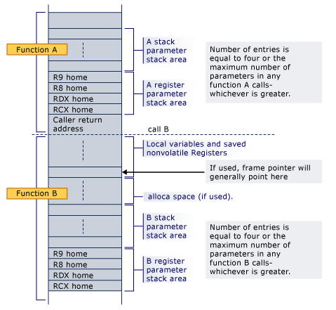

# [WIP] 两百行Rust代码解析绿色线程原理（五）附录：支持 Windows

> 原文: Green threads explained in 200 lines of rust language  
> 地址: https://cfsamson.gitbook.io/green-threads-explained-in-200-lines-of-rust/    
> 作者: Carl Fredrik Samson(cfsamson@Github)  
> 翻译: 耿腾

----

我们的示例适用于 OSX、Linux 和 Windows，但我之前曾指出，虽然这个实现在 Windows 上可以运行，但并不正确。因为我一直致力于使这个实现在所有三个平台上都能正确运行，所以我将在本章中介绍我们还需要做的事情。

你可能想知道为什么我没有在原始代码中包含此内容，其原因是，这实际上与解释我想探索的主要概念没有任何关系。

在这里，我试图进一步探讨如何为 Windows 正确设置栈并进行适当的上下文切换。即使我们可能无法一路写出完美的实现，也有大量信息和参考供你进一步探索，我将在这里列出其中的一些：

* [Microsoft x64 软件约定](https://docs.microsoft.com/en-us/cpp/build/x64-software-conventions?view=vs-2019)
* [Win64 / AMD64 API](https://wiki.lazarus.freepascal.org/Win64/AMD64_API) - psABi 与 Win64 之间差异的简要概述
* [适用于 Windows 的手工协程](https://probablydance.com/2013/02/20/handmade-coroutines-for-windows/) - 关于协程实现的好读物
* [Boost 环境中的汇编](https://github.com/boostorg/context/blob/develop/src/asm/ontop_x86_64_ms_pe_gas.asm) - 使用 C++，但它是进一步研究的良好参考

### Windows 的特殊之处

我认为该部本内容没有重要到值得出现在前文的一般性示例中的主要原因是，除了我们需要的一个文档很少记载的奇怪特性之外，Windows 只是有更多的“由被调用者保存的寄存器”，或者也有人叫它“非易失性寄存器”。所以我们真正要做的只是在执行上下文切换时保存更多数据，而这需要更多的条件编译。

> 即便不在满足基本理解需求的基础上增加太多东西，使用条件编译来支持 Windows 还是会使我们的代码几乎膨胀 50%，。
不过这并不意味着这项工作没有趣，但是从头开始做所有事情时，我们也会亲身体验支持多个平台的一些困难。

### 额外的由被调用方保存的（非易失性）寄存器

我提到的第一件事是 Windows 需要在上下文切换期间保存更多数据，尤其是 XMM6-XMM15 寄存器。这一点实际上[在这份参考资料中被特别提及了](https://docs.microsoft.com/en-us/cpp/build/x64-software-conventions?view=vs-2019#register-usage)，因此只需要向我们的 `ThreadContext` 结构中添加了更多字段。我们之前已经做过一次，所以很容易。

除了 `XMM` 寄存器，`rdi` 和 `rsi` 寄存器在 Windows 上也是非易失性的，这意味着它们已由被调用者保存（在Linux上，这些寄存器用于第一个和第二个函数参数），因此我们也需要添加它们。

不过有一个注意事项：`XMM` 寄存器是 128 位而不是 64 位的。Rust 有 `u128` 类型，但是我们将使用 `[u64; 2]` 来避免 _可能_ 导致的某些对齐问题。先不用担心，我会在下面进一步解释。

修改之后，我们的 `ThreadContext` 如下所示：

```rust
#[cfg(target_os="windows")]
#[derive(Debug, Default)]
#[repr(C)] 
struct ThreadContext {
    rsp: u64,
    r15: u64,
    r14: u64,
    r13: u64,
    r12: u64,
    rbx: u64,
    rbp: u64,
    rdi: u64,
    rsi: u64,
    xmm6: [u64; 2],
    xmm7: [u64; 2],
    xmm8: [u64; 2],
    xmm9: [u64; 2],
    xmm10: [u64; 2],
    xmm11: [u64; 2],
    xmm12: [u64; 2],
    xmm13: [u64; 2],
    xmm14: [u64; 2],
    xmm15: [u64; 2],
}
```

### 线程信息块

第二部分相关文档不多。 实际上，我一直在努力验证在现代 Windows 上如果直接跳过这个问题是如何导致失败的，不过已经有了来自[值得信赖的信息来源](https://github.com/boostorg/context/blob/develop/src/asm/ontop_x86_64_ms_pe_gas.asm#L116-L129)的[充足的参考资料](https://probablydance.com/2013/02/20/handmade-coroutines-for-windows/)，我毫无疑问我们需要解决这一问题。

你会看到，Windows希望将有关当前正在运行的线程的某些信息存储在它称为 “线程信息块（`Thread Information Block`）”（称为 NT_TIB）的结构中。具体来说，它希望访问 `%gs` 寄存器中有关 `Stack Base` 和 `Stack Limit` 的信息。

> 你可能会问 GS 寄存器是什么？
> 我找到的答案有些让人困惑。 显然，这些段寄存器（x64 上的 GS 和 x86 上的 FS）是 Intel 旨在[允许程序访问许多不同的内存段](https://stackoverflow.com/questions/10810203/what-is-the-fs- gs-register-intended-for)而设计的，它们原本打算作为永久性虚拟存储的一部分。现代操作系统不会以这种方式使用这些寄存器，因为我们只能访问自己的进程内存（对于程序员来说，它们看起来像是 “扁平” 内存）。当还不清楚这将是主流模型时，这些寄存器将允许由不同的操作系统进行不同的实现。如果你感到好奇，请参阅 [有关 Multics 操作系统的 Wikipedia 页](https://en.wikipedia.org/wiki/Multics)。

这意味着操作系统可以自由地将这些段寄存器用于其认为适当的用途。 Windows 将当前正在运行线程的相关信息存储在 GS 寄存器中，而 Linux 使用这些寄存器进行线程本地存储。

当我们切换线程时，我们应该提供其所需的关于[Stack Base 和 Stack Limit](https://en.wikipedia.org/wiki/Win32_Thread_Information_Block)的信息。

那么我们的 `ThreadContext` 就应该是这样的:

```rust
#[cfg(target_os="windows")]
#[derive(Debug, Default)]
#[repr(C)] 
struct ThreadContext {
    rsp: u64,
    r15: u64,
    r14: u64,
    r13: u64,
    r12: u64,
    rbx: u64,
    rbp: u64,
    rdi: u64,
    rsi: u64,
    xmm6: [u64; 2],
    xmm7: [u64; 2],
    xmm8: [u64; 2],
    xmm9: [u64; 2],
    xmm10: [u64; 2],
    xmm11: [u64; 2],
    xmm12: [u64; 2],
    xmm13: [u64; 2],
    xmm14: [u64; 2],
    xmm15: [u64; 2],
    stack_start: u64,
    stack_end: u64,
}
```

> 请注意，我们在所有Windows特定的函数和结构上都使用了 `#[cfg(target_os="windows")]` 属性，这意味着我们需要为最初的结构体定义增加一个属性，以确保能在所有其它非 Windows 平台上编译：`#[cfg(not(target_os="windows"))]`。

我将字段命名为 `stack_start` 和 `stack_end`，因为我发现这样更容易肉眼解析，我们都知道栈从顶部开始，然后向下扩展到底部。

### Windows 栈



因为 Rust 为我们设置好了栈帧，所以我们只需要关心将 `%rsp` 和返回地址放在哪里，这与 psABI 中的内容几乎相同。Win64 和 psABI 在其它方面还存在差异，而 Rust 为我们解决了目前所有差异。

现在要继续实现我们的代码，就需要对 `spawn()` 函数进行更改，来真正提供这些新增信息并设置我们的栈。

```rust
    #[cfg(target_os = "windows")]
    pub fn spawn(&mut self, f: fn()) {
        let available = self
            .threads
            .iter_mut()
            .find(|t| t.state == State::Available)
            .expect("no available thread.");

        let size = available.stack.len();
        let s_ptr = available.stack.as_mut_ptr();

        // 参考: https://docs.microsoft.com/en-us/cpp/build/stack-usage?view=vs-2019#stack-allocation
        unsafe {
            ptr::write(s_ptr.offset((size - 24) as isize) as *mut u64, guard as u64);
            ptr::write(s_ptr.offset((size - 32) as isize) as *mut u64, f as u64);
            available.ctx.rsp = s_ptr.offset((size - 32) as isize) as u64;
            available.ctx.stack_start = s_ptr.offset(size as isize) as u64;
        }
        available.ctx.stack_end = s_ptr as *const u64 as u64;

        available.state = State::Ready;
    }
}
```

如你所见，我们提供了指向栈开始的指针和指向栈结束的指针。

#### 可能的对齐问题

好的，这部分应该很难，还记得吗？Windows 从不会把事情变得太简单来让我们感到失望。你会看到，当我们从 128 位寄存器中移出数据时，我们需要使用一些特殊的汇编指令。其中有几个 _大多数_ 都在做同样的事：

* `movdqa` [move double quad word aligned](https://www.felixcloutier.com/x86/movdqa:vmovdqa32:vmovdqa64)
* `movdqu`[move double quad word unaligned](https://www.felixcloutier.com/x86/movdqu:vmovdqu8:vmovdqu16:vmovdqu32:vmovdqu64)
* `movaps`[move aligned packed single-precision floating point value](https://www.felixcloutier.com/x86/movaps)
* `movups`[move unaligned packed single-precision floating point value](https://www.felixcloutier.com/x86/movups)

如你所见，大多数方法都有 `aligned` 和 `unaligned` 变体。 区别在于，`*ps` 类型的指令针对浮点值，而 `*dq/*dq` 类型的指令针对整数。 现在两者都可以使用，但是如果你单击 Microsoft 的参考资料，你可能会注意到 `XMM` 用于浮点值，因此 `*ps` 类型的指令是我们应该使用的正确指令。

从历史上看，`aligned` 版本在大多数情况下要快一些，因此在上下文切换中会优先使用。但是，据我了解的最新信息是，**在性能方面，最近的 6 代 CPU 实际上都是一样的**。

> 如果你想了解有关新旧处理器上不同指令成本的更多信息，请查看[Agner Fog 的指令表](https://www.agner.org/optimize/instruction_tables.pdf)。

但是，由于在我遇到的所有参考实现中都使用了对齐的指令，因此尽管它们给我们暴露了一些额外的复杂性，我们还是会使用它们，我们也学到东西了，不是吗？

使用对齐指令，是指它们读写的内存是 16 字节对齐的。

现在，我解决此问题的方法是将需要对齐的字段推送到结构的开头，并添加新属性 `#[repr(align(16))]`。

> `#[repr(align(16))]` 属性确保我们的结构以 16 字节对齐的内存地址开始，因此当我们在汇编代码一开始写 `XMM6` 寄存器时，它已经是 16 字节对齐的，并且由于 128 被 16 整除，其余的字段也是如此。
但是（这可能很重要），因为我们现在有两种不同大小的字段，我们的编译器可能会选择“填充”我们的字段，但现在暂时不会发生这种情况，但是将较大的字段放到前面将使后期发生这种情况的风险降到最低。
我们也要避免手动将填充成员添加到结构中，因为在 `XMM` 字段之前有 7 个 `u64` 字段可以防止它们与 16 对齐（请记住，`repr(C)` 属性确保编译器不会对我们的字段进行重新排序）。

修改过后我们的 `Threadcontext` 将变成这样：

```rust
#[cfg(target_os = "windows")]
#[derive(Debug, Default)]
#[repr(C)]
#[repr(align(16))]
struct ThreadContext {
    xmm6: [u64; 2],
    xmm7: [u64; 2],
    xmm8: [u64; 2],
    xmm9: [u64; 2],
    xmm10: [u64; 2],
    xmm11: [u64; 2],
    xmm12: [u64; 2],
    xmm13: [u64; 2],
    xmm14: [u64; 2],
    xmm15: [u64; 2],
    rsp: u64,
    r15: u64,
    r14: u64,
    r13: u64,
    r12: u64,
    rbx: u64,
    rbp: u64,
    rdi: u64,
    rsi: u64,
    stack_start: u64,
    stack_end: u64,
}
```

最后我们需要修改 `switch()` 函数并更新我们的汇编代码。上文已经解释了这么多，应该很简单了：

```rust
#[cfg(target_os = "windows")]
#[naked]
#[inline(never)]
unsafe fn switch(old: *mut ThreadContext, new: *const ThreadContext) {
    asm!("
        movaps      %xmm6, 0x00($0)
        movaps      %xmm7, 0x10($0)
        movaps      %xmm8, 0x20($0)
        movaps      %xmm9, 0x30($0)
        movaps      %xmm10, 0x40($0)
        movaps      %xmm11, 0x50($0)
        movaps      %xmm12, 0x60($0)
        movaps      %xmm13, 0x70($0)
        movaps      %xmm14, 0x80($0)
        movaps      %xmm15, 0x90($0)
        mov         %rsp, 0xa0($0)
        mov         %r15, 0xa8($0)
        mov         %r14, 0xb0($0)
        mov         %r13, 0xb8($0)
        mov         %r12, 0xc0($0)
        mov         %rbx, 0xc8($0)
        mov         %rbp, 0xd0($0)
        mov         %rdi, 0xd8($0)
        mov         %rsi, 0xe0($0)
        mov         %gs:0x08, %rax    
        mov         %rax, 0xe8($0)  
        mov         %gs:0x10, %rax    
        mov         %rax, 0xf0($0)  

        movaps      0x00($1), %xmm6
        movaps      0x10($1), %xmm7
        movaps      0x20($1), %xmm8
        movaps      0x30($1), %xmm9
        movaps      0x40($1), %xmm10
        movaps      0x50($1), %xmm11
        movaps      0x60($1), %xmm12
        movaps      0x70($1), %xmm13
        movaps      0x80($1), %xmm14
        movaps      0x90($1), %xmm15
        mov         0xa0($1), %rsp
        mov         0xa8($1), %r15
        mov         0xb0($1), %r14
        mov         0xb8($1), %r13
        mov         0xc0($1), %r12
        mov         0xc8($1), %rbx
        mov         0xd0($1), %rbp
        mov         0xd8($1), %rdi
        mov         0xe0($1), %rsi
        mov         0xe8($1), %rax
        mov         %rax, %gs:0x08  
        mov         0xf0($1), %rax 
        mov         %rax, %gs:0x10  

        ret
        "
    :
    :"r"(old), "r"(new)
    :
    : "volatile", "alignstack"
    );
}
```

如你所见，我们的代码变得更长了一些。一旦确定了存储位置就很简单，但是它确实增加了很多代码。

> 我们的内联汇编程序不允许我们从一个内存偏移量 `mov` 到另一个内存偏移量，因此我们需要经由一个寄存器来实现。我选择了 `rax` 寄存器（返回值的默认寄存器），但你可以为此选择任何通用的寄存器。

### 结论

所以这就是我们需要做的。如你所见，我们在这里实际上并没有做任何新的事情，困难的部分是弄清楚Windows 的工作方式以及它期望你做的事，不过我们已经正确完成了支持 Windows 的工作，我们应该为所有三个平台都提供了相当完整的上下文切换的实现。

### 最终的代码

在最后我合并了我们需要针对 Windows 进行不同编译的所有代码，因此你不必阅读前 200 行代码，因为与前几章的内容相同。我希望你能理解为什么我选择为此单独写一章。

> 你也可以在[这个仓库的Windows分支](https://github.com/cfsamson/example-greenthreads/tree/windows)找到这份代码.

```rust
#![feature(asm)]
#![feature(naked_functions)]
use std::ptr;

const DEFAULT_STACK_SIZE: usize = 1024 * 1024 * 2;
const MAX_THREADS: usize = 4;
static mut RUNTIME: usize = 0;

pub struct Runtime {
    threads: Vec<Thread>,
    current: usize,
}

#[derive(PartialEq, Eq, Debug)]
enum State {
    Available,
    Running,
    Ready,
}

struct Thread {
    id: usize,
    stack: Vec<u8>,
    ctx: ThreadContext,
    state: State,
}

#[cfg(not(target_os = "windows"))]
#[derive(Debug, Default)]
#[repr(C)]
struct ThreadContext {
    rsp: u64,
    r15: u64,
    r14: u64,
    r13: u64,
    r12: u64,
    rbx: u64,
    rbp: u64,
}

impl Thread {
    fn new(id: usize) -> Self {
        Thread {
            id,
            stack: vec![0_u8; DEFAULT_STACK_SIZE],
            ctx: ThreadContext::default(),
            state: State::Available,
        }
    }
}

impl Runtime {
    pub fn new() -> Self {
        let base_thread = Thread {
            id: 0,
            stack: vec![0_u8; DEFAULT_STACK_SIZE],
            ctx: ThreadContext::default(),
            state: State::Running,
        };

        let mut threads = vec![base_thread];
        let mut available_threads: Vec<Thread> = (1..MAX_THREADS).map(|i| Thread::new(i)).collect();
        threads.append(&mut available_threads);

        Runtime {
            threads,
            current: 0,
        }
    }

    pub fn init(&self) {
        unsafe {
            let r_ptr: *const Runtime = self;
            RUNTIME = r_ptr as usize;
        }
    }

    pub fn run(&mut self) -> ! {
        while self.t_yield() {}
        std::process::exit(0);
    }

    fn t_return(&mut self) {
        if self.current != 0 {
            self.threads[self.current].state = State::Available;
            self.t_yield();
        }
    }

    fn t_yield(&mut self) -> bool {
        let mut pos = self.current;
        while self.threads[pos].state != State::Ready {
            pos += 1;
            if pos == self.threads.len() {
                pos = 0;
            }
            if pos == self.current {
                return false;
            }
        }

        if self.threads[self.current].state != State::Available {
            self.threads[self.current].state = State::Ready;
        }

        self.threads[pos].state = State::Running;
        let old_pos = self.current;
        self.current = pos;

        unsafe {
            switch(&mut self.threads[old_pos].ctx, &self.threads[pos].ctx);
        }

        // preventing compiler optimizing our code away on windows. Will never be reached anyway.
        self.threads.len() > 0
    }

    #[cfg(not(target_os = "windows"))]
    pub fn spawn(&mut self, f: fn()) {
        let available = self
            .threads
            .iter_mut()
            .find(|t| t.state == State::Available)
            .expect("no available thread.");

        let size = available.stack.len();
        let s_ptr = available.stack.as_mut_ptr();
        unsafe {
            ptr::write(s_ptr.offset((size - 24) as isize) as *mut u64, guard as u64);
            ptr::write(s_ptr.offset((size - 32) as isize) as *mut u64, f as u64);
            available.ctx.rsp = s_ptr.offset((size - 32) as isize) as u64;
        }
        available.state = State::Ready;
    }
}

fn guard() {
    unsafe {
        let rt_ptr = RUNTIME as *mut Runtime;
        (*rt_ptr).t_return();
    };
}

pub fn yield_thread() {
    unsafe {
        let rt_ptr = RUNTIME as *mut Runtime;
        (*rt_ptr).t_yield();
    };
}

#[cfg(not(target_os = "windows"))]
#[naked]
#[inline(never)]
unsafe fn switch(old: *mut ThreadContext, new: *const ThreadContext) {
    asm!("
        mov     %rsp, 0x00($0)
        mov     %r15, 0x08($0)
        mov     %r14, 0x10($0)
        mov     %r13, 0x18($0)
        mov     %r12, 0x20($0)
        mov     %rbx, 0x28($0)
        mov     %rbp, 0x30($0)
   
        mov     0x00($1), %rsp
        mov     0x08($1), %r15
        mov     0x10($1), %r14
        mov     0x18($1), %r13
        mov     0x20($1), %r12
        mov     0x28($1), %rbx
        mov     0x30($1), %rbp
        ret
        "
    :
    :"r"(old), "r"(new)
    :
    : "volatile", "alignstack"
    );
}

fn main() {
    let mut runtime = Runtime::new();
    runtime.init();
    runtime.spawn(|| {
        println!("THREAD 1 STARTING");
        let id = 1;
        for i in 0..10 {
            println!("thread: {} counter: {}", id, i);
            yield_thread();
        }
        println!("THREAD 1 FINISHED");
    });
    runtime.spawn(|| {
        println!("THREAD 2 STARTING");
        let id = 2;
        for i in 0..15 {
            println!("thread: {} counter: {}", id, i);
            yield_thread();
        }
        println!("THREAD 2 FINISHED");
    });
    runtime.run();
}

// ===== WINDOWS SUPPORT =====
#[cfg(target_os = "windows")]
#[derive(Debug, Default)]
#[repr(C)]
struct ThreadContext {
    xmm6: [u64; 2],
    xmm7: [u64; 2],
    xmm8: [u64; 2],
    xmm9: [u64; 2],
    xmm10: [u64; 2],
    xmm11: [u64; 2],
    xmm12: [u64; 2],
    xmm13: [u64; 2],
    xmm14: [u64; 2],
    xmm15: [u64; 2],
    rsp: u64,
    r15: u64,
    r14: u64,
    r13: u64,
    r12: u64,
    rbx: u64,
    rbp: u64,
    rdi: u64,
    rsi: u64,
    stack_start: u64,
    stack_end: u64,
}

impl Runtime {
    #[cfg(target_os = "windows")]
    pub fn spawn(&mut self, f: fn()) {
        let available = self
            .threads
            .iter_mut()
            .find(|t| t.state == State::Available)
            .expect("no available thread.");

        let size = available.stack.len();
        let s_ptr = available.stack.as_mut_ptr();

        // see: https://docs.microsoft.com/en-us/cpp/build/stack-usage?view=vs-2019#stack-allocation
        unsafe {
            ptr::write(s_ptr.offset((size - 24) as isize) as *mut u64, guard as u64);
            ptr::write(s_ptr.offset((size - 32) as isize) as *mut u64, f as u64);
            available.ctx.rsp = s_ptr.offset((size - 32) as isize) as u64;
            available.ctx.stack_start = s_ptr.offset(size as isize) as u64;
        }
        available.ctx.stack_end = s_ptr as *const u64 as u64;

        available.state = State::Ready;
    }
}

// reference: https://probablydance.com/2013/02/20/handmade-coroutines-for-windows/
// Contents of TIB on Windows: https://en.wikipedia.org/wiki/Win32_Thread_Information_Block
#[cfg(target_os = "windows")]
#[naked]
#[inline(never)]
unsafe fn switch(old: *mut ThreadContext, new: *const ThreadContext) {
    asm!("
        movaps      %xmm6, 0x00($0)
        movaps      %xmm7, 0x10($0)
        movaps      %xmm8, 0x20($0)
        movaps      %xmm9, 0x30($0)
        movaps      %xmm10, 0x40($0)
        movaps      %xmm11, 0x50($0)
        movaps      %xmm12, 0x60($0)
        movaps      %xmm13, 0x70($0)
        movaps      %xmm14, 0x80($0)
        movaps      %xmm15, 0x90($0)
        mov         %rsp, 0xa0($0)
        mov         %r15, 0xa8($0)
        mov         %r14, 0xb0($0)
        mov         %r13, 0xb8($0)
        mov         %r12, 0xc0($0)
        mov         %rbx, 0xc8($0)
        mov         %rbp, 0xd0($0)
        mov         %rdi, 0xd8($0)
        mov         %rsi, 0xe0($0)
        mov         %gs:0x08, %rax    
        mov         %rax, 0xe8($0)  
        mov         %gs:0x10, %rax    
        mov         %rax, 0xf0($0)  

        movaps      0x00($1), %xmm6
        movaps      0x10($1), %xmm7
        movaps      0x20($1), %xmm8
        movaps      0x30($1), %xmm9
        movaps      0x40($1), %xmm10
        movaps      0x50($1), %xmm11
        movaps      0x60($1), %xmm12
        movaps      0x70($1), %xmm13
        movaps      0x80($1), %xmm14
        movaps      0x90($1), %xmm15
        mov         0xa0($1), %rsp
        mov         0xa8($1), %r15
        mov         0xb0($1), %r14
        mov         0xb8($1), %r13
        mov         0xc0($1), %r12
        mov         0xc8($1), %rbx
        mov         0xd0($1), %rbp
        mov         0xd8($1), %rdi
        mov         0xe0($1), %rsi
        mov         0xe8($1), %rax
        mov         %rax, %gs:0x08  
        mov         0xf0($1), %rax 
        mov         %rax, %gs:0x10  

        ret
        "
    :
    :"r"(old), "r"(new)
    :
    : "volatile", "alignstack"
    );
}

```

